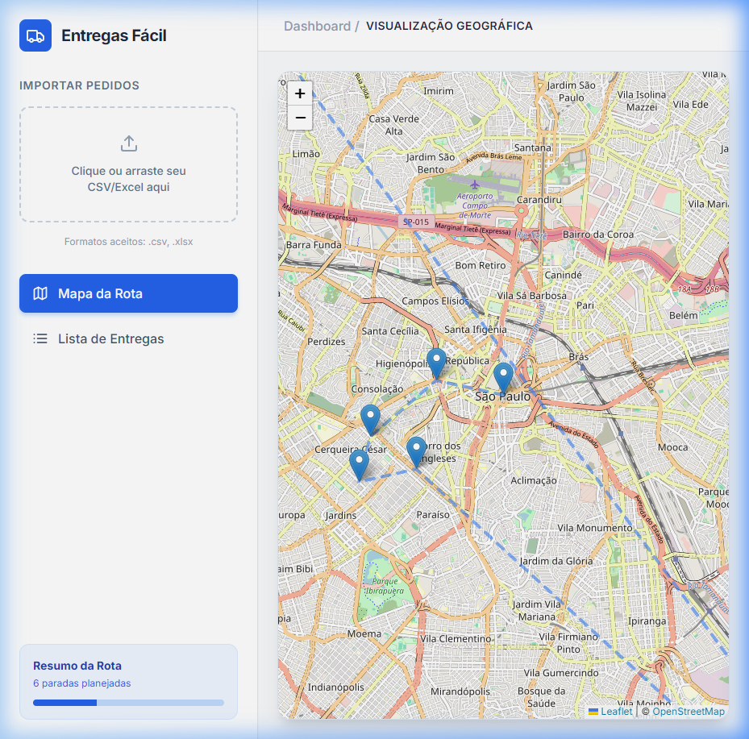
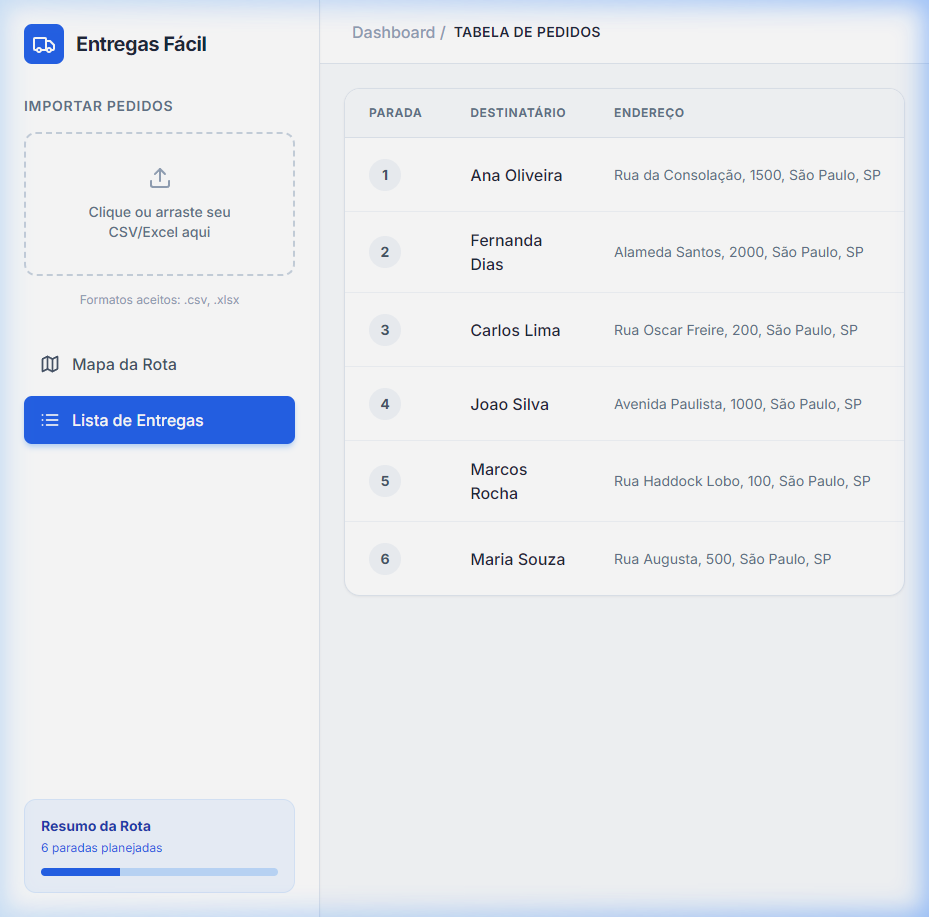

# 🚚 Entregas Fácil - Otimizador de Rotas Logísticas

Bem-vindo ao **Entregas Fácil**! Este é um projeto que desenvolvi para resolver um problema real de logística: a organização de rotas de entrega. O objetivo principal é permitir que o usuário importe uma lista de pedidos (como uma planilha da Shopee ou Mercado Livre) e receba instantaneamente a melhor sequência de paradas, economizando tempo e combustível.

## 📸 Demonstração


*Visualização geográfica da rota otimizada.*


*Gestão de status e detalhes das paradas.*

## 🚀 O que este projeto faz?

O sistema atua como um assistente inteligente para o entregador:
1.  **Importação Flexível:** Aceita arquivos CSV e Excel com nomes e endereços dos clientes.
2.  **Geocodificação Automática:** Utilizo a API do OpenStreetMap (Nominatim) para transformar endereços escritos em coordenadas geográficas (Latitude/Longitude).
3.  **Algoritmo de Roteirização:** Implementei o algoritmo do **Vizinho Mais Próximo** (*Nearest Neighbor*). O sistema calcula a distância entre os pontos e sugere a parada mais próxima a partir da base ou da última entrega realizada.
4.  **Mapa Interativo:** Exibição visual da rota completa e dos pontos de entrega usando Leaflet.
5.  **Gestão de Entregas:** Interface para acompanhar o progresso e marcar entregas como concluídas em tempo real.

## 🛠 Tecnologias Utilizadas

### Frontend
- **React.js**: Para uma interface rápida e reativa.
- **Tailwind CSS**: Estilização moderna com foco em usabilidade.
- **Leaflet & React Leaflet**: Para manipulação de mapas e geoprocessamento.
- **Lucide React**: Biblioteca de ícones profissionais.

### Backend
- **Node.js & Express**: Servidor robusto para processamento de dados.
- **SQLite**: Banco de dados leve e eficiente para persistência local.
- **Multer**: Gerenciamento de upload de arquivos.
- **Docker**: Containerização para garantir que o projeto rode em qualquer ambiente.

## 📦 Como Rodar o Projeto

### Usando Docker (Recomendado)
Para rodar a aplicação completa (Frontend + Backend + Banco de Dados) com apenas um comando:
```bash
docker-compose up --build
```
Acesse o sistema em: `http://localhost:5173`

### Rodando Localmente
1.  **Backend:** Entre na pasta `backend`, rode `npm install` e depois `npm run dev`.
2.  **Frontend:** Entre na pasta `frontend`, rode `npm install` e depois `npm run dev`.

---

## 📄 Exemplo de Arquivo de Teste
Para testar o sistema, você pode usar um arquivo `.csv` com o seguinte formato:

```csv
destinatario,endereco_completo
João Silva,"Avenida Paulista, 1000, São Paulo, SP"
Maria Souza,"Rua Augusta, 500, São Paulo, SP"
```

---
*Este projeto foi desenvolvido com foco em aprendizado de algoritmos de geolocalização e arquitetura fullstack.* 🚀
